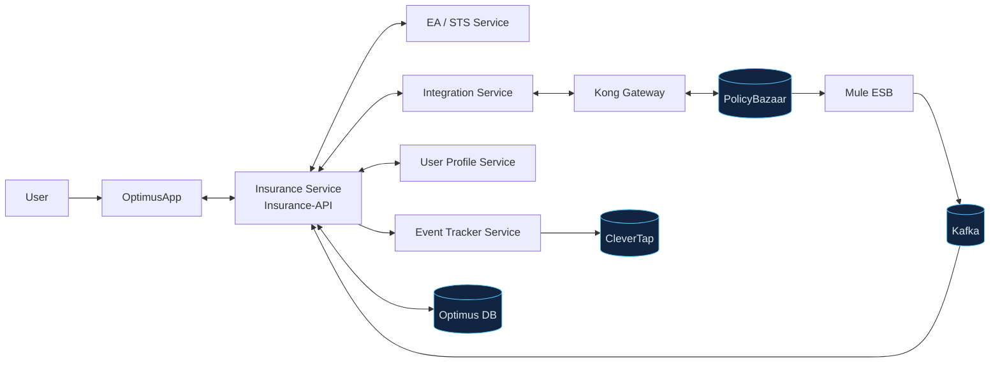
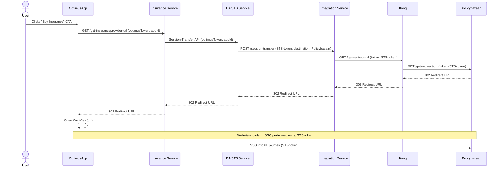
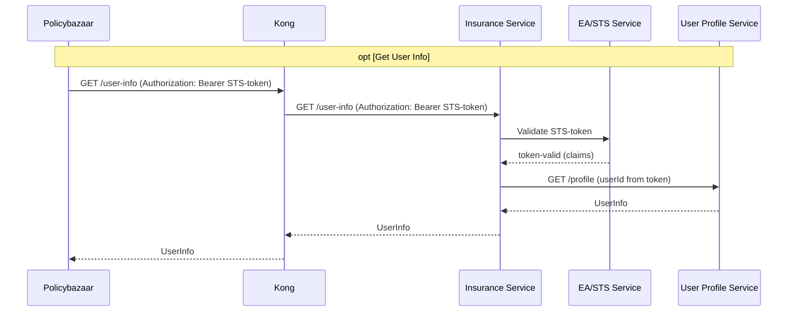
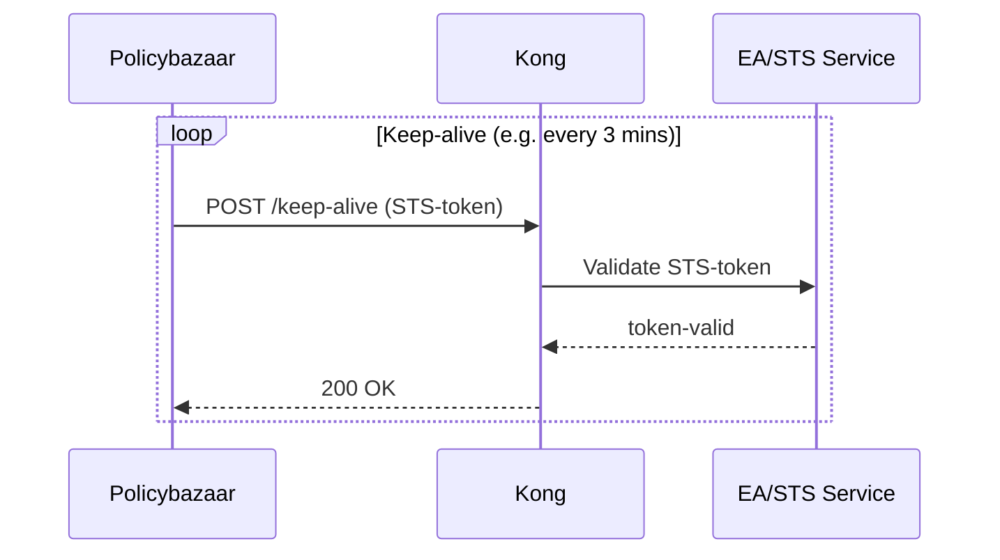
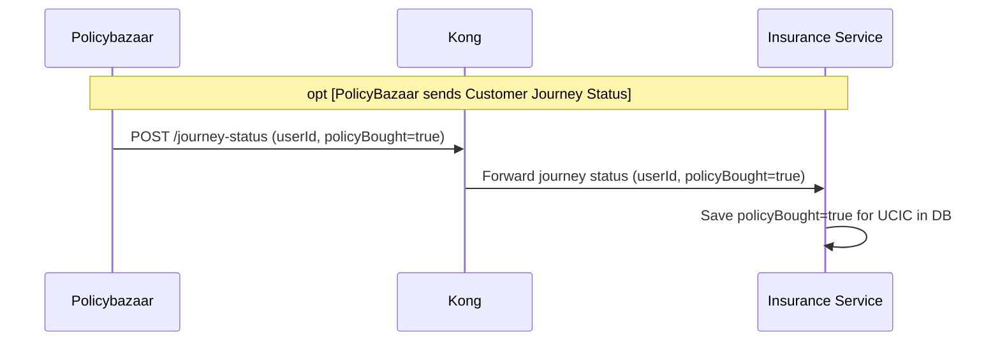
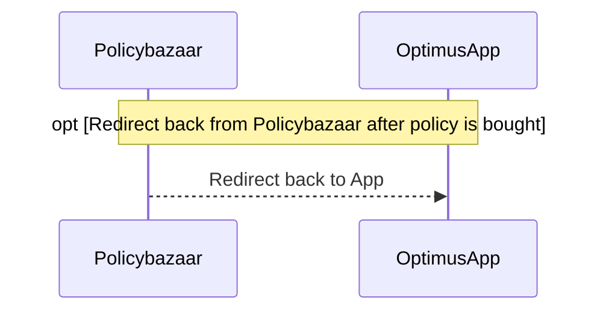
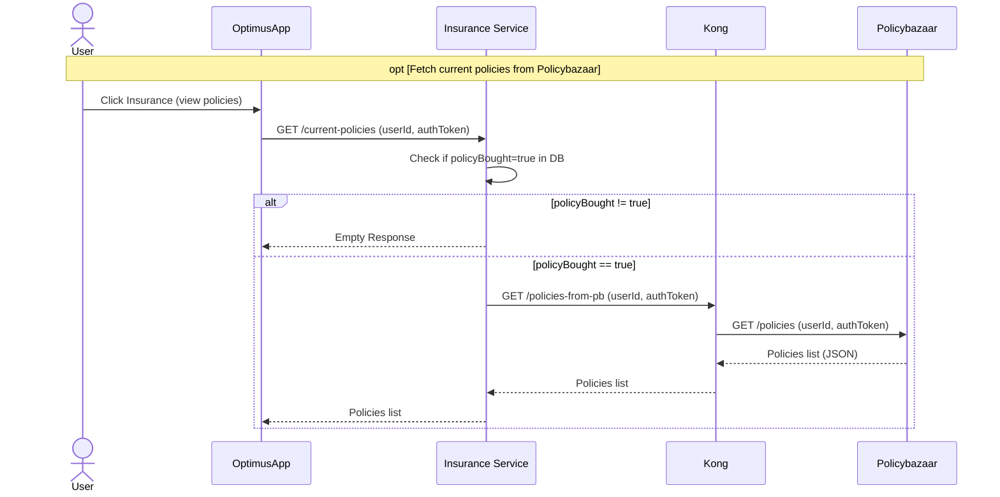
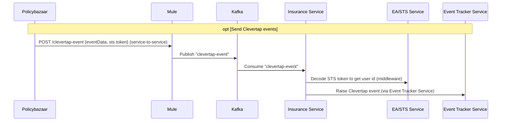

# PolicyBazaar (PB) ↔ Optimus Insurance Integration — Complete Architecture Notes

> **Rev 3.0** — Adds exact API contracts (URLs, request/response payloads, auth handshake, error codes) sourced from Shreyas Mahajan's API-contracts doc, plus a reconciliation list of points where the contract doc disagrees with the sequence diagrams.
> Companion file: `PB_Optimus_Integration.html` (interactive mind-map + diagrams version of this same content).

---

## Table of Contents

0. [System Map (everything at a glance)](#0-system-map)
1. [Architecture & Hosting](#1-architecture--hosting)
2. [Flow 1 — Buy Insurance CTA → SSO Redirect](#2-flow-1--buy-insurance-cta--sso-redirect)
3. [Flow 2 — PB Fetches User Info](#3-flow-2--pb-fetches-user-info)
4. [Flow 3 — Keep-Alive Loop](#4-flow-3--keep-alive-loop)
5. [Flow 4 — Journey Status Update](#5-flow-4--journey-status-update)
6. [Flow 5 — Redirect Back to App](#6-flow-5--redirect-back-to-app)
7. [Flow 6 — Fetch Current Policies (microservice-level)](#7-flow-6--fetch-current-policies-microservice-level)
8. [Flow 7 — Policy Persistence Pattern (high-level)](#8-flow-7--policy-persistence-pattern-high-level)
9. [Flow 8 — CleverTap Event Pipeline](#9-flow-8--clevertap-event-pipeline)
10. [Session Management](#10-session-management)
11. [Security Management](#11-security-management)
12. [Component Glossary](#12-component-glossary)
13. [API Reference (summary)](#13-api-reference-summary)
14. [API Contracts — Detailed Payloads](#14-api-contracts--detailed-payloads)
15. [Reconciliation Needed (diagram vs. written contract)](#15-reconciliation-needed-diagram-vs-written-contract)
16. [Future Scope & Open Items](#16-future-scope--open-items)

---

## 0. System Map



**Rough sketch version:**
```
User → OptimusApp ⇄ Insurance Service ⇄ EA/STS Service
                              ⇄ Integration Service ⇄ Kong ⇄ PolicyBazaar
                              ⇄ User Profile Service
                              ⇄ Optimus DB (policy / session flags)

PolicyBazaar --(events)--> Mule --> Kafka --> Insurance Service --> Event Tracker --> CleverTap
```

---

## 1. Architecture & Hosting

| Aspect | Detail |
|---|---|
| **Architecture Type** | SaaS-based deployment, built & managed by PolicyBazaar for IDFC Bank |
| **Hosting** | 100% on AWS |
| **AWS Account** | Dedicated account in **IDFC's name** — NOT shared with PB's own environment |
| **Provisioning** | Fully managed/provisioned by PolicyBazaar |
| **Multi-tenancy** | None — built fully from scratch, dedicated to IDFC only |
| **Code Ownership** | Source repo + deployment pipelines owned by **IDFC** |
| **Branding** | White-labeled — customer always experiences the journey as "IDFC" (branding, access, comms) — PB is invisible to the end user |

---

## 2. Flow 1 — Buy Insurance CTA → SSO Redirect



**Rough sketch:**
```
User --click--> OptimusApp --get-insuranceprovider-url--> Insurance Service
  --session-transfer--> EA/STS --> Integration Service --get-redirect-url--> Kong --> PB
PB --302 redirect url--> Kong --> Integration Svc --> EA/STS --> Insurance Svc --> OptimusApp
OptimusApp opens WebView(url) → SSO with STS-token → PB journey loads
```

> **Confirmed contract (PB-side):** the final hop in this chain is PB's own `getRedirectionURL` API — see [§14](#14-api-contracts--detailed-payloads). Note it's documented as a **POST**, not the **GET** shown in the original sequence diagram — see [§15](#15-reconciliation-needed-diagram-vs-written-contract).

---

## 3. Flow 2 — PB Fetches User Info



**Rough sketch:**
```
PB --GET /user-info (Bearer STS-token)--> Kong --> Insurance Service
Insurance Service --validate--> EA/STS --token valid (claims)--> Insurance Service
Insurance Service --GET /profile(userId)--> User Profile Service --UserInfo--> Insurance Service
Insurance Service --UserInfo--> Kong --UserInfo--> PB
```

> **Confirmed contract:** the real API name is **`getUserDetailsForPolicyBazaar`**, and the auth is a **two-token handshake**, not just "Bearer STS-token" — PB must first call an EntAuth API to mint an EntAuth token, then call this API with *both* the EntAuth token and the STS token in headers. Full payload and error codes in [§14](#14-api-contracts--detailed-payloads).

---

## 4. Flow 3 — Keep-Alive Loop



**Rough sketch:**
```
every 3 min:  PB --POST /keep-alive(STS-token)--> Kong --validate--> EA/STS --valid--> Kong --200 OK--> PB
```

> **Confirmed contract:** exact URL is `POST https://app.auth.idfcfirstbank.com/api/session-transfer/v2/session/keepalive` — empty body, bearer STS-token, `200` with empty body on success, `401` if the token is invalid. See [§14](#14-api-contracts--detailed-payloads).

---

## 5. Flow 4 — Journey Status Update



**Rough sketch:**
```
PB --POST /journey-status(userId, policyBought=true)--> Kong --> Insurance Service
Insurance Service: saves policyBought=true against UCIC in its own DB
```

> **Confirmed contract:** real name is **`policyStatusChangeEvent`**, `POST insurance/v1/customerJourneyStatus`, payload `{ userId, policyBought: true/false }`. The contract doc says auth is **"same as other APIs (with Mule)"** — worth confirming whether that means Mule fronts this call instead of/in addition to Kong. See [§15](#15-reconciliation-needed-diagram-vs-written-contract).

---

## 6. Flow 5 — Redirect Back to App



**Resume-journey rule:** if the user abandons the journey midway and comes back to the Insurance page later, Optimus simply re-opens the WebView pointing at PB — **PB owns resuming state**, not Optimus.

---

## 7. Flow 6 — Fetch Current Policies (microservice-level)



**Rough sketch:**
```
User clicks "view policies" → OptimusApp --GET /current-policies--> Insurance Service
  Insurance Service checks local DB flag (policyBought)
    not true → Empty Response immediately (no PB call)
    true     → Insurance Service --GET /policies-from-pb--> Kong --> PB
               PB --Policies list (JSON)--> Kong --> Insurance Service --> OptimusApp
```

> **Confirmed contract (PB-side):** PB's real API is **`getPolicies`**, returning a `healthPolicies` array. The contract doc shows **two competing request shapes** for this call — see [§14](#14-api-contracts--detailed-payloads) and [§15](#15-reconciliation-needed-diagram-vs-written-contract).

---

## 8. Flow 7 — Policy Persistence Pattern (high-level)

> `policyBought` (Flow 6) and `userHasPoliciesWithPB` (this flow) are the **same conceptual flag**. **This flow is now explicitly confirmed** by the written spec, word for word:
> 1. PB redirects back the user with a boolean flag — `policyBuySuccessful`.
> 2. On receiving this flag, Optimus fetches the policies from PB.
> 3. On receiving the policies, Optimus stores a flag — `userHasPoliciesWithPB` — in Optimus DB.
> 4. On every subsequent login, policies are fetched from PB **only when** `userHasPoliciesWithPB` is set.

```mermaid
sequenceDiagram
    actor U as User
    participant O as Optimus
    participant PB as PB
    participant DB as Optimus DB

    rect rgb(17,37,64)
    Note over U,DB: First Time / Policy Purchase Flow
    PB-->>U: Redirect to Optimus (policyBuySuccessful=true)
    U->>O: Request with policyBuySuccessful flag
    O->>PB: Fetch policies
    PB-->>O: Return policy details
    O->>DB: Store userHasPoliciesWithPB = true
    O-->>U: Display policies / dashboard
    end

    rect rgb(17,37,64)
    Note over U,DB: Subsequent Logins
    U->>O: Login Request
    O->>DB: Check userHasPoliciesWithPB flag
    alt flag is true
        DB-->>O: userHasPoliciesWithPB = true
        O->>PB: Fetch policies
        PB-->>O: Return policy details
    else flag is false / not set
        DB-->>O: userHasPoliciesWithPB = false
        Note right of O: Skip PB policy fetch
    end
    O-->>U: Display dashboard
    end
```



**Rough sketch:**
```
FIRST-TIME PURCHASE
PB --redirect(policyBuySuccessful=true)--> User --request w/ flag--> Optimus
Optimus --fetch policies--> PB --policy details--> Optimus
Optimus --store userHasPoliciesWithPB=true--> OptimusDB
Optimus --display dashboard--> User

SUBSEQUENT LOGIN
User --login--> Optimus --check flag--> OptimusDB
   flag=true  → Optimus --fetch policies--> PB --details--> Optimus
   flag=false → skip PB call entirely
Optimus --display dashboard--> User
```

---

## 9. Flow 8 — CleverTap Event Pipeline



**Rough sketch:**
```
PB --POST /clevertap-event {eventData, sts-token}--> Mule (service-to-service)
Mule --publish "clevertap-event"--> Kafka
Kafka --consume--> Insurance Service
Insurance Service --decode STS token (middleware)--> EA/STS Service
Insurance Service --raise event--> Event Tracker Service --> CleverTap
```

> **Status:** the IDFC-side API name is locked in as **`publishClevertapEvent`**, but the written contract doc marks its full request/response shape as **TBD**. The flow design above (Mule → Kafka → Insurance Service → Event Tracker) is agreed; the wire contract is not yet specified.

---

## 10. Session Management

| # | Rule |
|---|---|
| 1 | Optimus sends an **STS-token** to PB at redirect time (Flow 1) |
| 2 | STS-token is valid **only while the user's Optimus session is active** |
| 3 | For every future PB→IDFC call (user-info, keep-alive, clevertap-event, etc.), PB must pass this STS-token in the request header/body |
| 4 | EA/STS Service validates the token on every call — if the Optimus session has gone inactive, the token is treated as invalid and an **error** is returned to PB |
| 5 | If valid, the requested data (e.g. UserInfo) is returned |
| 6 | PB keeps the session alive via the periodic **keep-alive** API exposed by Optimus (Flow 3) |
| 7 | **(New)** For `getUserDetailsForPolicyBazaar` specifically, the STS-token alone isn't sufficient — PB must also obtain a separate **EntAuth token** first and send both tokens together. See [§14](#14-api-contracts--detailed-payloads). |

---

## 11. Security Management

- **Kong Gateway Protection:** all Kong-exposed APIs are protected by an **Enterprise Authorization (Ent Auth) token** — this is the same `EntAuth token` referenced in the `getUserDetailsForPolicyBazaar` contract, confirming Kong's Ent Auth requirement is real and concrete, not just a diagram label.
- **Transport Security:** all communication between PolicyBazaar and Kong is **encrypted end-to-end** — both request and response payloads.
- All PB traffic into IDFC's environment is forced through Kong (or Mule, for the async event path) — there is no direct path from PB into internal services or directly into CleverTap.
- PB's own APIs (`getRedirectionURL`, `getPolicies`) are currently protected by a **hardcoded bearer token** plus an `Origin` header allow-list, per the written contract — flagged in [§15](#15-reconciliation-needed-diagram-vs-written-contract) as worth revisiting before go-live (hardcoded tokens are typically a placeholder for QA, not a production-grade scheme).

---

## 12. Component Glossary

| Component | Role |
|---|---|
| **User** | End customer using the OptimusApp |
| **OptimusApp** | IDFC's mobile app — hosts the PB journey in a WebView |
| **Insurance Service (Insurance-API)** | IDFC backend orchestrating the insurance journey; also the Kafka consumer for CleverTap events |
| **EA/STS Service** | Mints & validates the STS token; also decodes it to resolve user identity for event middleware |
| **Integration Service** | Talks to Kong to fetch redirect URLs / proxy calls to PB |
| **User Profile Service** | Returns IDFC customer profile data |
| **Kong** | API Gateway for synchronous PB ⇄ IDFC traffic — Ent Auth + TLS |
| **Mule** | ESB used for async CleverTap event ingress, and per the contract doc, possibly fronting `getUserDetailsForPolicyBazaar` / `policyStatusChangeEvent` base URLs too (pending confirmation) |
| **Kafka** | Event bus — decouples PB event emission from Insurance Service processing |
| **Event Tracker Service** | Abstraction layer that actually pushes events into CleverTap |
| **Optimus DB** | Stores session/purchase flags such as `policyBought` / `userHasPoliciesWithPB` |
| **Policybazaar (PB)** | White-labeled insurance journey provider (SaaS, AWS-hosted in IDFC's account) |
| **CleverTap** | IDFC's marketing/behavioral-analytics platform (destination for PB events) |
| **EntAuth API** | Separate token-minting API (owner: Rajesh, per contract doc) that PB must call before calling `getUserDetailsForPolicyBazaar` |

---

## 13. API Reference (summary)

| API | Caller → Callee | Purpose |
|---|---|---|
| `getUserDetailsForPolicyBazaar` | PB → (Kong/Mule) → Insurance Service | PB fetches logged-in user's KYC/profile details |
| `keep-alive` | PB → Kong → EA/STS Service | Heartbeat to keep session/token alive |
| `policyStatusChangeEvent` | PB → (Kong/Mule) → Insurance Service | PB reports `policyBought` status |
| `publishClevertapEvent` | PB → Mule | PB emits a behavioral event (contract **TBD**) |
| `getRedirectionURL` | Integration Service → PB | Resolve the PB landing URL for SSO redirect |
| `getPolicies` | Insurance Service → PB | Fetch the user's purchased policy list |

> Full URLs, payloads, and error codes are in [§14](#14-api-contracts--detailed-payloads).

---

## 14. API Contracts — Detailed Payloads

> Source: API-contracts note by **Shreyas Mahajan**.

### 14.1 APIs exposed by IDFC

#### a) `getUserDetailsForPolicyBazaar`

- **URL:** `GET insurance/v1/getUserDetailsForPolicyBazaar` *(exact base URL pending Mule confirmation)*
- **Auth handshake (two tokens, in this order):**
  1. PB calls the **EntAuth API** (owner: Rajesh) to obtain an EntAuth token.
  2. PB calls `getUserDetailsForPolicyBazaar` with the **EntAuth token** in one header and the **STS token** in another header parameter named `stsToken`. The STS token is decrypted by an OAuth middleware service.
- **Request body:** empty.
- **Response body:**
  ```json
  {
    "insuredDetails": {
      "gender": "Male",
      "title": "Mr",
      "firstName": "TestFirstName",
      "middleName": "TestMiddleName",
      "lastName": "TestLastName",
      "dateOfBirth": "1970-08-12 00:00:00",
      "maritalStatus": "Married",
      "age": 40,
      "insuredPAN": "ABCD1234E",
      "occupationType": "Salaried"
    },
    "insuredContactDetails": {
      "mobileNo": "6789054321",
      "email": "test@test.com"
    },
    "mailingAddress": {
      "mailingAddressPinCode": "400601",
      "mailingAddressLine1": "Mumbai",
      "mailingAddressLine2": "",
      "mailingAddressLine3": "",
      "mailingAddressLine4": "Mumbai",
      "mailingAddressCity": "Mumbai",
      "mailingAddressState": { "stateName": "MAHARASHTRA", "stateCode": "60" },
      "mailingAddressCountry": { "countryName": "INDIA", "countryCode": "IN" }
    },
    "permanentAddress": {
      "permanentAddressPinCode": "400601",
      "permanentAddressLine1": "Society Mumbai",
      "permanentAddressLine2": "Street Hemanth",
      "permanentAddressLine3": "Landmark Hemanth",
      "permanentAddressLine4": "Mumbai",
      "permanentAddressCity": "Mumbai",
      "permanentAddressState": { "stateName": "MAHARASHTRA", "stateCode": "60" },
      "permanentAddressCountry": { "countryName": "INDIA", "countryCode": "IN" }
    },
    "userId": "ABCDE",
    "ckycNumber": "123232",
    "spouse": {
      "title": "",
      "firstName": "",
      "middleName": "",
      "lastName": "",
      "name": ""
    },
    "account": {
      "number": "21495212562",
      "branchCode": "",
      "branchName": "",
      "ifscCode": "461751505"
    }
  }
  ```
  - `userId` is **NOT** the UCIC — it's an external user id shared by the User Profile Service.
  - `account.number` is shown without an explicit `isPrimary` flag in the sample, but the source note flags that **`isPrimary` may come back as `false` for retail accounts** — worth confirming how PB should interpret that.
  - `spouse` is optional.
- **Error scenarios:**
  - `401 Unauthorized` — STS token invalid.
  - `500 Internal Server Error` — any other failure retrieving details.

#### b) `keep-alive` *(already live)*

- **URL:** `POST https://app.auth.idfcfirstbank.com/api/session-transfer/v2/session/keepalive`
- **Request:** empty body, `Authorization: Bearer <STS-token>`
- **Response:** `200 OK`, empty body
- **Error scenarios:** `401 Unauthorized` if STS token is invalid.

#### c) `publishClevertapEvent` *(TBD)*

- Name is agreed; exact request/response contract not yet specified (see Flow 8).

#### d) `policyStatusChangeEvent`

- **URL:** `POST insurance/v1/customerJourneyStatus`
- **Payload:**
  ```json
  { "userId": "<id>", "policyBought": true }
  ```
- **Auth:** "same as other APIs (with Mule)" — per the source note.

### 14.2 APIs exposed by PolicyBazaar

#### a) `getRedirectionURL`

- **Request (curl):**
  ```bash
  curl --request POST \
    --url https://idfchealthqa.internalpb.com/api/Health/GetIDFCURL \
    --header 'Authorization: Bearer {Hardcoded token}' \
    --header 'Content-Type: application/json' \
    --header 'Origin: <allowed-origin>' \
    --data '{ "Token": "STS token" }'
  ```
- **Response:**
  ```json
  { "RedirectionURL": "https://myaccidfc.internalpb.com/?t=70zubcizdCCYHz..." }
  ```
- **Note:** `idfchealthqa.internalpb.com` is PB's **temporary/QA domain**. PB is expected to share the production domain; once shared, the URL needs to be **whitelisted** and get **ISG temporary approval** before go-live.

#### b) `getPolicies`

- **Request — two variants documented (needs reconciliation, see §15):**
  - Variant 1 (path param): `GET {policybazaar-base-url}/users/{userId}/policies`
  - Variant 2 (encrypted body): `POST <PB URL>` with body `{ "userId": "<encrypted userId>" }`
  - **Headers (both variants):** `Authorization: Bearer {Hardcoded token}`, `Content-Type: application/json`, `Origin: <allowed-origin>`
- **Response:**
  ```json
  {
    "userId": "abcde123",
    "healthPolicies": [
      {
        "policyNumber": "123456",
        "policyName": "HDFC Cancer Care",
        "premiumAmount": "1234",
        "coverAmount": "1000000",
        "bookingDate": "23/10/2020",
        "insuredMembers": [
          { "name": "Jim Doe", "relation": "Spouse" }
        ],
        "proposer": "John Doe",
        "policyEndDate": "23/10/2020",
        "nextPremiumDueDate": "23/09/2020",
        "premiumFrequency": "MONTHLY/QUARTERLY/ANNUAL",
        "totalPremiumPaidAmount": "60000"
      }
    ]
  }
  ```

---

## 15. Reconciliation Needed (diagram vs. written contract)

These are points where the original whiteboard sequence diagrams and the written API-contracts note **don't line up exactly** — flagged here rather than silently resolved one way, so the team can confirm intent.

| # | Diagram says | Written contract says | What to confirm |
|---|---|---|---|
| 1 | `getRedirectionURL` is a **GET** | `getRedirectionURL` is a **POST** with a `{Token}` body | Which verb is final |
| 2 | `GET /user-info` with just `Bearer STS-token` | `getUserDetailsForPolicyBazaar` needs **STS token + a separately-minted EntAuth token** | Update the diagram's auth assumption everywhere this pattern repeats |
| 3 | `POST /journey-status` routed via **Kong** | `policyStatusChangeEvent` auth is "same as other APIs (**with Mule**)" | Whether Mule fronts this call instead of/alongside Kong |
| 4 | — | `getPolicies` has **two different request shapes** documented (GET w/ path param vs. POST w/ encrypted body) | Pick one final contract |
| 5 | Flow 8 design (Mule→Kafka→Insurance Service→Event Tracker) is finalized | `publishClevertapEvent` wire contract marked **TBD** | Design ≠ contract yet — contract still needed before build |
| 6 | — | Base URLs for `insurance/v1/*` APIs depend on **"Mule confirmation"** (not yet finalized) | Get final base URL once Mule team confirms |
| 7 | — | PB's redirection domain (`idfchealthqa.internalpb.com`) is **temporary/QA** | Get production domain from PB, then whitelist + ISG temp approval |
| 8 | — | PB's own APIs use a **hardcoded bearer token** | Confirm this is QA-only and a production auth scheme will replace it |

---

## 16. Future Scope & Open Items

- **CleverTap integration** — design finalized (Flow 8), but the **`publishClevertapEvent` wire contract is still TBD**. Not yet part of MVP rollout.
- **PB redirection domain** — currently QA/temporary; pending PB sharing the production domain, then IDFC whitelisting + ISG temporary approval.
- **Base URL confirmation** — `insurance/v1/*` APIs are pending final base URL from the Mule team.
- **Kong vs. Mule routing** — confirm which gateway layer fronts `getUserDetailsForPolicyBazaar` and `policyStatusChangeEvent` (see §15, items 2–3).
- **`getPolicies` contract** — two competing request shapes documented; needs to be narrowed to one (see §15, item 4).
- **Production-grade auth for PB's own APIs** — `getRedirectionURL` / `getPolicies` currently use a hardcoded bearer token in the written contract; confirm this isn't carried into production.

---

*Document generated from PB Detailed Architecture sequence diagrams (5 source images) + accompanying design notes + Shreyas Mahajan's API-contracts note. Keep this file and `PB_Optimus_Integration.html` in the same folder — the HTML's "Download notes" link points here.*
